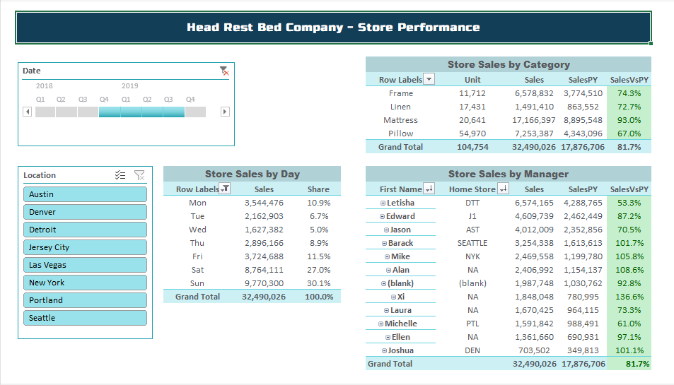

# 🛏️ Head Rest Bed Company – Excel Dashboard Project


This project showcases two Interactive, slick-looking dashboards built in **Excel** using **Power Query, Power Pivot, and Pivot Tables/Charts**.  
The dashboards provide a business overview and store performance insights for the **Head Rest Bed Company**.

---

## 🎯 Objective
The objective of this project is to build an **interactive, Excel-based business intelligence solution** for the Head Rest Bed Company that enables:

- **Comprehensive sales analysis** across stores, products, and time periods  
- **Performance evaluation** of individual stores and managers  
- **Comparison with prior periods** to identify growth trends  
- **Quick decision-making** using KPIs, visualizations, and conditional formatting  
- **Scalable and reusable reporting** using Power Query, Power Pivot, and DAX

---

## 📑 Table of Contents
- [🎯 Objective](#-objective)  
- [📌 Project Workflow](#-project-workflow)
- [🖥️ Dashboard 1 – Business Overview](#️-dashboard-1--business-overview)  
- [🖥️ Dashboard 2 – Store Performance](#️-dashboard-2--store-performance)  
- [🔑 Key Business Insights](#-key-business-insights)  
- [📌 Conclusion](#-conclusion)  
- [🛠️ Tools & Techniques Used](#️-tools--techniques-used)  
- [🚀 How to Use](#-how-to-use)  
- [✅ Outcomes](#-outcomes)  

---

## 📌 Project Workflow  

### 1️⃣ Loaded Dimension Tables  
From <a href="/Dim_Tables.xlsx">Dim_Table.xlsxs</a>, the following sheets were added to the **Power Pivot Data Model**:  
- `Dim_Stores` → Stores Table  
- `Dim_Products` → Products Table  
- `Dim_Dates` → Date Table  

---

### 2️⃣ Loaded Fact Table  
- From <a href="/Dim_Tables.xlsx">SalesData.xlsx</a>, imported the **Sales** sheet into **Power Pivot**.  
- This acted as the **Fact Table** for the analysis.  

---

### 3️⃣ Adjusted Data Types  
- Set `Sales[DateID]` → **Date**  
- Set `Dim_Dates[Date]` → **Date**  

---

### 4️⃣ Marked Date Table  
- From the **Design tab**, marked `Dim_Dates` as the **Date Table** using the `Date` column.  
- Enabled usage of **DAX Time Intelligence Functions**.  

---

### 5️⃣ Sorted Columns  
- Sorted `Month` by `MonthNum` → Ensured correct order (*Jan, Feb, Mar, …*).  
- Sorted `WeekDay` by `WeekDayNum` → Ensured correct order (*Mon, Tue, …*).  

---

### 6️⃣ Created Relationships  
In **Diagram View**, relationships were set as follows:  
- `Sales[ProductID]` → `Dim_Products[SKU]`  
- `Sales[StoreID]` → `Dim_Stores[Store ID]`  
- `Sales[DateID]` → `Dim_Dates[Date]`  
- `Sales[ManagerID]` → `Dim_Managers[ManagerID]`  

---

### 7️⃣ Power Query Transformation (Dim_Managers)  
The **Managers Table** contained duplicate rows, so it was transformed in **Power Query** before loading into the Model:  
- Changed column data types  
- Removed duplicates on `ManagerID`  
- Dropped unnecessary column `Date Left Company`  
- Merged with `Dim_Commission` on `Time in Service = Years`  
- Expanded the `Commission` column from the merged table  
- Changed `Commission` type to **Percentage**  
- Loaded cleaned `Dim_Managers` into the **Data Model**  
- Created relationship: `Sales[ManagerID]` → `Dim_Managers[ManagerID]`  

---

### 8️⃣ DAX Calculations  

#### 🔹 Calculated Columns  

**Store Type (Friendly Names)**  
```DAX
StoreTypeName =
    SWITCH([Store Type],
        "SM", "SMALL",
        "MED", "MEDIUM",
        "WAREHOUSE", "WAREHOUSE",
        "OTHER"
    )
```  

**Gross Profit ($)**  
```DAX
MarginDollars = [Units Sold] * [UnitPrice] * [RawMargin]
```  

---

#### 🔹 Measures  

**Margin Amount**  
```DAX
MarginAmt := SUM(Sales[MarginDollars])
```  

**Units Sold**  
```DAX
Units := SUM(Sales[Units Sold])
```  

**Total Sales**  
```DAX
Sales := SUMX(Sales, [Units Sold] * [UnitPrice])
```  

**Margin Percentage**  
```DAX
MarginPct := [MarginAmt] / [Sales]
```  

**Sales as % of Total (by Dates)**  
```DAX
SalesPctOfTotalDates :=
VAR TotalSales = CALCULATE([Sales], ALLSELECTED(Dim_Dates))
RETURN [Sales] / TotalSales
```  

**Prior Year Sales**  
```DAX
SalesPY := CALCULATE([Sales], SAMEPERIODLASTYEAR(Dim_Dates[Date]))
```  

**Sales vs Prior Year %**  
```DAX
SalesVsPY :=
    DIVIDE(([Sales] - [SalesPY]), [SalesPY], "NA")
```  

---

### 9️⃣ Business Overview Dashboard  

**Pivot Tables**  
- `PivotLocation` → Sales by store location  
- `PivotCategory` → Sales by product category  
- `PivotBrand` → Sales by brand  

**Filters**  
- 3 Slicers: **Category, Brand, Store Size**  
- 1 Timeline: **Quarterly filter**  

**Visualization**  
- Built a **Bar Chart** to display **monthly sales trends**  

**Interactivity**  
- Connected the **Slicers** and **Timeline** only to the **relevant pivot tables and bar chart** for **dynamic filtering**  

---

### 🔟 Store Performance Dashboard  

**Pivot Tables**  
- `PivotDOW` → Sales by Day of Week  
- `PivotCategory2` → Sales by product category (detailed view)  
- `PivotManager` → Sales by manager  

**Filters**  
- Slicer: **Location**  
- Timeline: **Quarterly filter (same as Business Overview Dashboard)**  

**Visualization**  
- Built pivot-based charts to analyze **store performance by category, manager, and time**  

**Interactivity**  
- Connected the **Slicers** and **Timeline** only to the **relevant pivot tables** for **dynamic filtering**  
- Ensured pivot tables **do not auto-fit column widths** each time a slicer is applied (disabled *Autofit Column Width on Update*)  

---

## 🖥️ Dashboard 1 – Business Overview
**File:** `Dashboard_Overview.xlsx`

### Key Features
- Interactive **slicers** for Date, Category, Brand, and Store Size  
- KPI metrics: Units, Margin %, Sales, Sales vs Prior Year (SalesVsPY)  
- Pivot tables showing:
  - Sales by Store  
  - Sales by Brand  
  - Sales by Category  
- Status indicators (conditional formatting with traffic-light symbols)  
- Monthly sales trend chart (bar chart)

### Screenshot


---

## 🖥️ Dashboard 2 – Store Performance
**File:** `Dashboard_Performance.xlsx`

### Key Features
- Interactive **slicers** for Location and Date  
- Store performance broken down by:
  - Sales by Category  
  - Sales by Manager  
  - Sales by Day (with daily share %)  
- Prior year comparison (Sales vs PY %) with conditional formatting  
- Highlight managers’ contribution with clear performance status  

### Screenshot


---

## 🔑 Key Business Insights

### 1️⃣ Overall Sales Performance
- **Total Units Sold:** 211,520  
- **Total Sales Value:** 65,509,727  
- **Overall Margin Percentage:** 29.4%  
- **Sales Growth vs Previous Year:** 105.1% → 5.1% growth YoY  

✅ *The business shows healthy growth with a positive margin trend.*

---

### 2️⃣ Sales by Store
- **Highest Sales:** Las Vegas → 50,962 units | 17,226,979 sales  
- **Lowest Sales:** Denver → 7,779 units | 1,443,418 sales  
- **Margin % Trend:** 26–31% across most stores  
- **Status Indicator:** 🟢 All stores performing well relative to targets  

💡 *Las Vegas leads in revenue but has a slightly below-average margin. Seattle shows impressive growth vs PY (121%).*

---

### 3️⃣ Sales by Category
- **Pillows** → Major volume driver  
- **Mattress & Frame** → High-margin opportunities  

👉 *Promoting high-margin categories can significantly improve profitability.*

---

### 4️⃣ Sales by Brand
- **Lux Bed** → Highest margin potential but lower sales volume  
- **Only Beds & Head Rest** → Primary volume drivers

---

### 5️⃣ Monthly & Daily Sales Trends
- **Peak Months:** Dec 2018, Mar 2019, Nov–Dec 2019 → seasonal spikes  
- **Low Months:** Jun–Aug → noticeable dip  
- **Highest Sales Day:** Sunday → 19,598,510 (~30% of weekly sales)  
- **Lowest Sales Day:** Wednesday → 3,307,375 (~5% of weekly sales)  

📌 *Align marketing and inventory strategies with seasonality. Weekend promotions, especially Sundays, are highly impactful.*

---

### 6️⃣ Manager Performance
**Top Performers (Sales vs PY >110%):**  
- Ellen → 131.9%  
- Barack → 114.1%  
- Alan → 112.6%  
- Joshua → 111.8%  
- Xi → 110.7%  

**Underperformers (Sales vs PY <100%):**  
- Michelle → 89.7%  
- Letisha → 95.9%  

📊 *Top managers drive growth. Underperformers may need coaching or strategy adjustments.*

---

### 7️⃣ Key Takeaways
- **Volume Drivers:** Pillows (category), Only Beds (brand)  
- **Highest Revenue Store:** Las Vegas  
- **Highest Margin Opportunity:** Mattress (category), Lux Bed (brand)  
- **Seasonality:** Peak months = Dec & Mar  
- **Daily Trend:** Sunday = top sales day  
- **Overall Growth:** 5.1% YoY → positive trend with margin optimization opportunities

---

## 📌 Conclusion  
This analysis provides a **clear, data-driven view of sales performance** for the Head Rest Bed Company.  
It highlights **strengths, seasonal patterns, and improvement areas** for effective strategic planning.  

---

## 🛠️ Tools & Techniques Used
- **Excel Power Query** → Data cleaning, transformations, merging tables  
- **Excel Power Pivot** → Data Model, DAX measures, star schema setup  
- **Pivot Tables & Charts** → For aggregated KPIs and visualizations  
- **Slicers** → For interactivity and filtering  
- **Conditional Formatting** → For KPIs and status indicators  

---

## 🚀 How to Use
1. Open the `.xlsx` <a href="/HeadRestBed_DashboardReport.xlsx">HeadRestBed_DashboardReport.xlsx</a> files in Excel (2016 or later with Power Pivot enabled).  
2. Use the slicers to filter the data (Date, Location, Category, Brand, etc.).  
3. Explore the interactive dashboards to analyze:
   - Overall business performance (Dashboard 1)  
   - Detailed store and manager performance (Dashboard 2)  

---

## ✅ Outcomes
- Built a scalable **Excel-based BI solution** without external tools  
- Enabled **interactive analysis** across dimensions (time, category, store, brand, manager)  
- Delivered both **executive overview** and **detailed performance insights**

